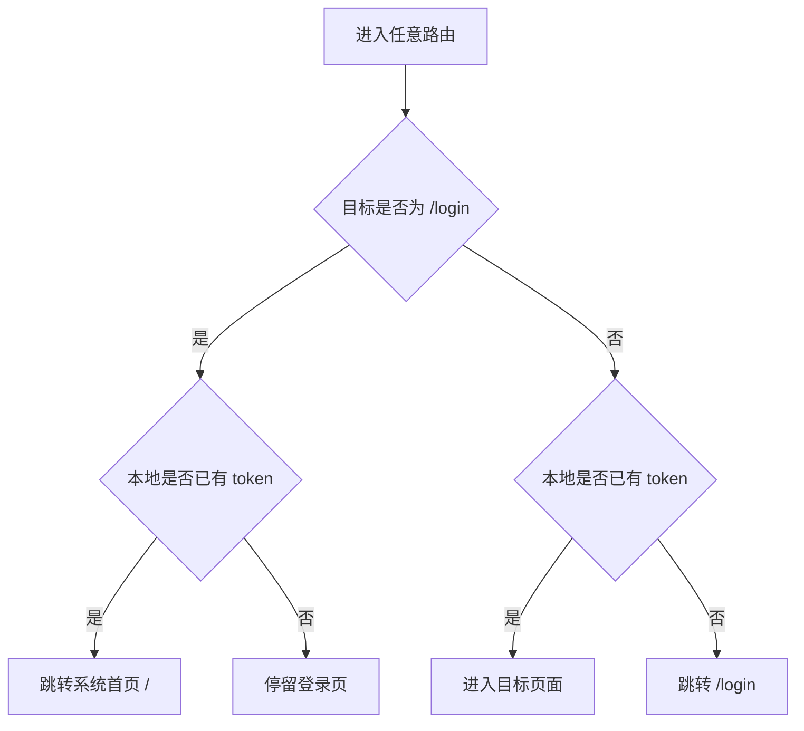

# 刘康6月24日前端路由与页面布局草案

## 1. 文档目标

本文档用于完成刘康 6月24日的两项前端任务：

- 设计页面路由结构。
- 确定 8 个页面布局草案。

本文档只做页面结构和布局规划，不涉及具体 Vue 代码实现。

## 2. 前端页面清单

| 序号 | 页面 | 路由 | 优先级 | 主要作用 |
|---|---|---|---|---|
| 1 | 管理员登录页 | `/login` | P0 | 管理员登录系统 |
| 2 | 系统首页 | `/` | P0 | 查看系统状态和核心统计 |
| 3 | 视频分析页 | `/analysis` | P0 | 上传视频、绘制 ROI、启动分析、查看结果 |
| 4 | 报警中心页 | `/alarms` | P0 | 查看新报警、确认事件、标记误报 |
| 5 | 历史事件页 | `/history` | P1 | 查询历史事件、查看截图、回放视频 |
| 6 | 数据看板页 | `/dashboard` | P1 | 展示事件趋势、置信度分布、状态分布 |
| 7 | 参数设置页 | `/settings` | P1 | 配置检测阈值和报警参数 |
| 8 | 实时监控页 | `/monitor` | P2 | 摄像头实时画面和 YOLO 检测框展示 |

## 3. 路由结构设计

### 3.1 路由层级图

```mermaid
flowchart TD
    A[浏览器访问系统] --> B{是否已登录}
    B -- 否 --> L[/login 管理员登录页]
    B -- 是 --> M[主布局 MainLayout]

    L -->|登录成功| M

    M --> H[/ 系统首页]
    M --> V[/analysis 视频分析页]
    M --> A1[/alarms 报警中心页]
    M --> E[/history 历史事件页]
    M --> D[/dashboard 数据看板页]
    M --> S[/settings 参数设置页]
    M --> C[/monitor 实时监控页]
```

### 3.2 路由守卫逻辑



### 3.3 路由配置草案

| 路由 | 页面组件 | 是否需要登录 | 菜单显示 | 说明 |
|---|---|---|---|---|
| `/login` | `LoginView.vue` | 否 | 否 | 登录页，独立布局 |
| `/` | `HomeView.vue` | 是 | 是 | 默认首页 |
| `/analysis` | `VideoAnalysisView.vue` | 是 | 是 | 主演示核心页面 |
| `/alarms` | `AlarmCenterView.vue` | 是 | 是 | 报警处理页面 |
| `/history` | `HistoryView.vue` | 是 | 是 | 历史事件回放 |
| `/dashboard` | `DashboardView.vue` | 是 | 是 | 数据统计看板 |
| `/settings` | `SettingsView.vue` | 是 | 是 | 参数设置 |
| `/monitor` | `MonitorView.vue` | 是 | 是 | 摄像头辅演示 |

## 4. 全局页面框架草案

除登录页外，其余 7 个页面共用主布局。

```text
┌──────────────────────────────────────────────────────────────┐
│ 顶部栏：系统名称 | 当前页面标题 | 后端状态 | 用户：admin | 退出 │
├───────────────┬──────────────────────────────────────────────┤
│ 侧边菜单       │ 主内容区                                      │
│               │                                              │
│ 首页          │ 页面标题                                      │
│ 视频分析      │ 页面操作区                                    │
│ 报警中心      │ 页面数据区                                    │
│ 历史事件      │ 页面结果区                                    │
│ 数据看板      │                                              │
│ 参数设置      │                                              │
│ 实时监控      │                                              │
└───────────────┴──────────────────────────────────────────────┘
```

主布局说明：

| 区域 | 内容 |
|---|---|
| 顶部栏 | 系统名称、页面标题、服务状态、当前用户、退出按钮 |
| 侧边菜单 | 7 个受保护页面入口 |
| 主内容区 | 当前页面主体 |
| 状态提示 | loading、错误、空状态统一展示 |

## 5. 8个页面布局草案

### 5.1 管理员登录页 `/login`

用途：输入固定管理员账号密码，登录成功后进入系统首页。

```text
┌──────────────────────────────────────────────────────────────┐
│                                                              │
│                  高空抛物监测系统                            │
│              High-altitude Object Monitoring                 │
│                                                              │
│          ┌──────────────────────────────────────┐            │
│          │ 管理员登录                            │            │
│          │                                      │            │
│          │ 账号 username [ admin            ]  │            │
│          │ 密码 password [ ********         ]  │            │
│          │                                      │            │
│          │ [ 登录系统 ]                         │            │
│          │                                      │            │
│          │ 错误提示：账号或密码错误              │            │
│          └──────────────────────────────────────┘            │
│                                                              │
└──────────────────────────────────────────────────────────────┘
```

接口：

- `POST /api/auth/login`

字段映射：

| 页面显示 | 前端绑定字段 | 后端请求字段 |
|---|---|---|
| 账号 | `form.username` | `username` |
| 密码 | `form.password` | `password` |

关键交互：

- 登录成功：保存 token，跳转 `/`。
- 登录失败：显示错误提示。

### 5.2 系统首页 `/`

用途：展示系统运行状态和核心统计，作为进入系统后的总览页面。

```text
┌───────────────┬──────────────────────────────────────────────┐
│ 侧边菜单       │ 系统首页                                      │
│ 首页          │                                              │
│ 视频分析      │ ┌──────────┐ ┌──────────┐ ┌──────────┐       │
│ 报警中心      │ │ 后端状态 │ │ 算法状态 │ │ 数据库状态│       │
│ 历史事件      │ │ running  │ │ ready    │ │ connected│       │
│ 数据看板      │ └──────────┘ └──────────┘ └──────────┘       │
│ 参数设置      │                                              │
│ 实时监控      │ ┌──────────┐ ┌──────────┐ ┌──────────┐       │
│               │ │ 今日事件 │ │ 累计事件 │ │ 设备状态 │       │
│               │ │    2     │ │    15    │ │ GPU/CPU  │       │
│               │ └──────────┘ └──────────┘ └──────────┘       │
│               │                                              │
│               │ 最近事件列表                                  │
│               │ ┌────────────────────────────────────────┐   │
│               │ │ 时间 | 置信度 | 状态 | 操作             │   │
│               │ └────────────────────────────────────────┘   │
└───────────────┴──────────────────────────────────────────────┘
```

接口：

- `GET /api/health`
- `GET /api/system/status`
- `GET /api/statistics/overview`

关键交互：

- 后端离线时状态卡片变红。
- 6月25日先接入 `GET /api/health` 和 `GET /api/system/status`。
- 今日事件、累计事件、最近事件列表先做静态占位，显示 `--` 或“暂无数据”。
- 6月30日 `GET /api/statistics/overview` 完成后，再接入真实统计数据。

### 5.3 视频分析页 `/analysis`

用途：主演示核心页面，完成上传视频、绘制 ROI、启动分析、查看进度和结果。

```text
┌───────────────┬──────────────────────────────────────────────┐
│ 侧边菜单       │ 视频分析                                      │
│               │                                              │
│               │ ┌──────────────────┐ ┌──────────────────┐   │
│               │ │ 1. 上传视频       │ │ 2. 快速参数       │   │
│               │ │ [选择文件]        │ │ 置信度 0.35      │   │
│               │ │ 文件名 demo.mp4   │ │ [使用默认参数]   │   │
│               │ └──────────────────┘ └──────────────────┘   │
│               │                                              │
│               │ ┌────────────────────────────────────────┐   │
│               │ │ 3. 视频首帧预览 + ROI 绘制              │   │
│               │ │                                        │   │
│               │ │        ┌────────────────────┐          │   │
│               │ │        │                    │          │   │
│               │ │        │     ROI 矩形框      │          │   │
│               │ │        │                    │          │   │
│               │ │        └────────────────────┘          │   │
│               │ └────────────────────────────────────────┘   │
│               │                                              │
│               │ [开始分析]  进度：████████░░ 80%             │
│               │                                              │
│               │ ┌──────────────────┐ ┌──────────────────┐   │
│               │ │ 结果视频播放      │ │ 事件列表          │   │
│               │ │ <video>          │ │ 时间/置信度/状态  │   │
│               │ └──────────────────┘ └──────────────────┘   │
└───────────────┴──────────────────────────────────────────────┘
```

接口：

- `POST /api/videos/upload`
- `POST /api/tasks/{task_id}/analyze`
- `GET /api/tasks/{task_id}`
- `GET /api/files?path=...`

关键交互：

- 上传后显示首帧。
- 鼠标拖拽生成 ROI。
- 点击开始分析后轮询任务进度。
- 分析完成后显示结果视频和事件列表。
- 本页只保留检测置信度快速调整。
- 完整 6 个系统参数统一到 `/settings` 页面维护，避免两处参数不同步。

### 5.4 报警中心页 `/alarms`

用途：显示未确认报警事件，支持确认事件和标记误报。

```text
┌───────────────┬──────────────────────────────────────────────┐
│ 侧边菜单       │ 报警中心                                      │
│               │                                              │
│               │ ┌────────────────────────────────────────┐   │
│               │ │ 最新报警弹窗                            │   │
│               │ │ 疑似高空抛物事件                         │   │
│               │ │ 时间：2026-06-24 15:12                  │   │
│               │ │ 置信度：0.82                             │   │
│               │ │ [查看详情] [确认事件] [标记误报]          │   │
│               │ └────────────────────────────────────────┘   │
│               │                                              │
│               │ ┌────────────────────────────────────────┐   │
│               │ │ 报警事件列表                            │   │
│               │ │ ID | 时间 | 置信度 | 状态 | 操作          │   │
│               │ │ 1  | 15:12 | 0.82 | 未确认 | 详情/确认   │   │
│               │ └────────────────────────────────────────┘   │
│               │                                              │
│               │ ┌──────────────────┐ ┌──────────────────┐   │
│               │ │ 事件截图          │ │ 事件详情          │   │
│               │ │ image            │ │ 轨迹/状态/来源    │   │
│               │ └──────────────────┘ └──────────────────┘   │
└───────────────┴──────────────────────────────────────────────┘
```

接口：

- `GET /api/events`
- `GET /api/events/{event_id}`
- `PATCH /api/events/{event_id}/status`
- `GET /api/files?path=...`

关键交互：

- 新事件显示明显报警提示。
- 点击确认后状态变为 `confirmed`。
- 点击误报后状态变为 `false_alarm`。

### 5.5 历史事件页 `/history`

用途：筛选历史事件，查看截图和结果视频。

```text
┌───────────────┬──────────────────────────────────────────────┐
│ 侧边菜单       │ 历史事件                                      │
│               │                                              │
│               │ ┌────────────────────────────────────────┐   │
│               │ │ 筛选条件                                │   │
│               │ │ 时间范围 [开始] - [结束]                 │   │
│               │ │ 状态 [全部]  最低置信度 [0.35] [查询]    │   │
│               │ └────────────────────────────────────────┘   │
│               │                                              │
│               │ ┌────────────────────────────────────────┐   │
│               │ │ 事件列表                                │   │
│               │ │ ID | 时间 | 置信度 | 状态 | 详情 | 回放  │   │
│               │ └────────────────────────────────────────┘   │
│               │                                              │
│               │ ┌──────────────────┐ ┌──────────────────┐   │
│               │ │ 截图预览          │ │ 结果视频回放      │   │
│               │ │ image            │ │ <video controls> │   │
│               │ └──────────────────┘ └──────────────────┘   │
└───────────────┴──────────────────────────────────────────────┘
```

接口：

- `GET /api/events`
- `GET /api/events/{event_id}`
- `GET /api/files?path=...`

关键交互：

- 支持按时间、状态、置信度筛选。
- 无事件时显示空状态。
- 结果视频缺失时禁用回放按钮。

### 5.6 数据看板页 `/dashboard`

用途：展示事件统计结果，用于答辩中说明系统具备数据统计能力。

```text
┌───────────────┬──────────────────────────────────────────────┐
│ 侧边菜单       │ 数据看板                                      │
│               │                                              │
│               │ ┌──────────┐ ┌──────────┐ ┌──────────┐       │
│               │ │ 今日事件 │ │ 累计事件 │ │ 未确认数 │       │
│               │ └──────────┘ └──────────┘ └──────────┘       │
│               │                                              │
│               │ ┌────────────────────────────────────────┐   │
│               │ │ 事件趋势折线图                          │   │
│               │ │ ECharts Line                            │   │
│               │ └────────────────────────────────────────┘   │
│               │                                              │
│               │ ┌──────────────────┐ ┌──────────────────┐   │
│               │ │ 置信度分布柱状图   │ │ 状态分布饼图      │   │
│               │ │ ECharts Bar      │ │ ECharts Pie      │   │
│               │ └──────────────────┘ └──────────────────┘   │
│               │                                              │
│               │ 最近事件 Top5                                │
└───────────────┴──────────────────────────────────────────────┘
```

接口：

- `GET /api/statistics/overview`

关键交互：

- 统计接口失败时卡片显示 `--`。
- 图表数据为空时显示空状态。

### 5.7 参数设置页 `/settings`

用途：配置检测和报警规则参数。

```text
┌───────────────┬──────────────────────────────────────────────┐
│ 侧边菜单       │ 参数设置                                      │
│               │                                              │
│               │ ┌────────────────────────────────────────┐   │
│               │ │ 检测参数                                │   │
│               │ │ 检测置信度          [0.35        ]      │   │
│               │ │ 连续下降帧占比      [0.70        ]      │   │
│               │ │ 最小垂直位移        [80 像素     ]      │   │
│               │ │ 最小连续帧数        [5 帧        ]      │   │
│               │ │ ROI内轨迹点占比     [0.70        ]      │   │
│               │ │ 报警冷却时间        [10 秒       ]      │   │
│               │ │                                        │   │
│               │ │ [保存参数] [恢复默认]                    │   │
│               │ └────────────────────────────────────────┘   │
│               │                                              │
│               │ 参数说明：调整后影响后续新任务，不改变历史事件 │
└───────────────┴──────────────────────────────────────────────┘
```

接口：

- `GET /api/settings`
- `PUT /api/settings`

关键交互：

- 页面加载时读取参数。
- 保存前做基础范围校验。
- 保存成功后提示“参数已保存”。

### 5.8 实时监控页 `/monitor`

用途：摄像头辅演示，展示本机摄像头实时画面和 YOLO 检测框。

```text
┌───────────────┬──────────────────────────────────────────────┐
│ 侧边菜单       │ 实时监控                                      │
│               │                                              │
│               │ ┌────────────────────────────────────────┐   │
│               │ │ 摄像头控制                              │   │
│               │ │ 状态：stopped / running                 │   │
│               │ │ 分辨率：640x480  FPS：15                │   │
│               │ │ [打开摄像头] [关闭摄像头] [刷新状态]     │   │
│               │ └────────────────────────────────────────┘   │
│               │                                              │
│               │ ┌────────────────────────────────────────┐   │
│               │ │ 实时画面                                │   │
│               │ │                                        │   │
│               │ │           │   │
│               │ │       显示检测框后的 MJPEG 画面          │   │
│               │ │                                        │   │
│               │ └────────────────────────────────────────┘   │
│               │                                              │
│               │ 提示：该页面只做辅演示，不要求事件入库        │
└───────────────┴──────────────────────────────────────────────┘
```

接口：

- `POST /api/camera/start`
- `GET /api/camera/status`
- `GET /api/camera/stream`
- `POST /api/camera/stop`

关键交互：

- 打开摄像头后显示 MJPEG 流。
- 关闭摄像头后释放资源。
- 摄像头被占用时显示错误提示。

## 6. 页面跳转关系

```mermaid
flowchart LR
    Login[/login 登录页] --> Home[/ 首页]
    Home --> Analysis[/analysis 视频分析]
    Analysis --> Alarms[/alarms 报警中心]
    Analysis --> History[/history 历史事件]
    Alarms --> History
    History --> Dashboard[/dashboard 数据看板]
    Home --> Dashboard
    Home --> Monitor[/monitor 实时监控]
    Home --> Settings[/settings 参数设置]
```

## 7. 主演示页面路径

主演示建议按以下顺序操作：

```text
/login
→ /
→ /analysis
→ /alarms
→ /history
→ /dashboard
```

对应演示内容：

| 顺序 | 页面 | 展示点 |
|---|---|---|
| 1 | 登录页 | 管理员登录 |
| 2 | 系统首页 | 后端、算法、数据库状态 |
| 3 | 视频分析页 | 上传视频、ROI、分析进度、结果视频 |
| 4 | 报警中心页 | 报警弹窗、事件确认 |
| 5 | 历史事件页 | 事件筛选、截图、视频回放 |
| 6 | 数据看板页 | 统计图表 |

## 8. 前端组件拆分草案

| 组件 | 使用页面 | 作用 |
|---|---|---|
| `MainLayout.vue` | 除登录页外的 7 个页面 | 顶部栏、侧边菜单、主内容区 |
| `RoiCanvas.vue` | 视频分析页 | 视频首帧 ROI 绘制 |
| `VideoPlayer.vue` | 视频分析页、历史事件页 | 播放结果视频 |
| `ProgressBar.vue` | 视频分析页 | 展示任务分析进度 |
| `EventCard.vue` | 报警中心页、历史事件页 | 展示事件摘要 |
| `AlarmPopup.vue` | 报警中心页 | 弹窗报警和声音提示 |
| `StatusCard.vue` | 系统首页 | 展示后端、算法、数据库状态 |
| `StatCard.vue` | 系统首页、数据看板页 | 展示统计数字 |

## 9. 6月24日交付结论

刘康 6月24日的前端规划任务已完成：

- 已确定 8 个页面。
- 已确定每个页面的路由路径。
- 已确定页面之间的跳转关系。
- 已确定登录鉴权和路由守卫逻辑。
- 已确定每个页面的布局草案。
- 已明确每个页面依赖的后端接口。

后续 6月25日可基于本文档开始搭建 Vue Router、主布局、登录页和系统首页。
